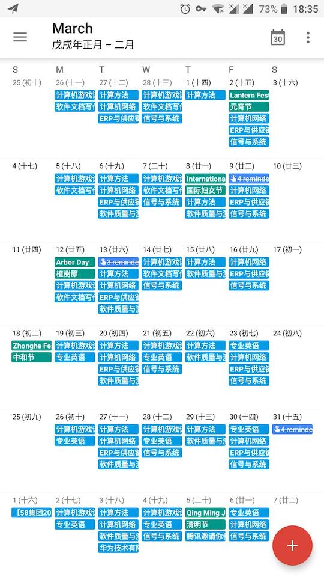
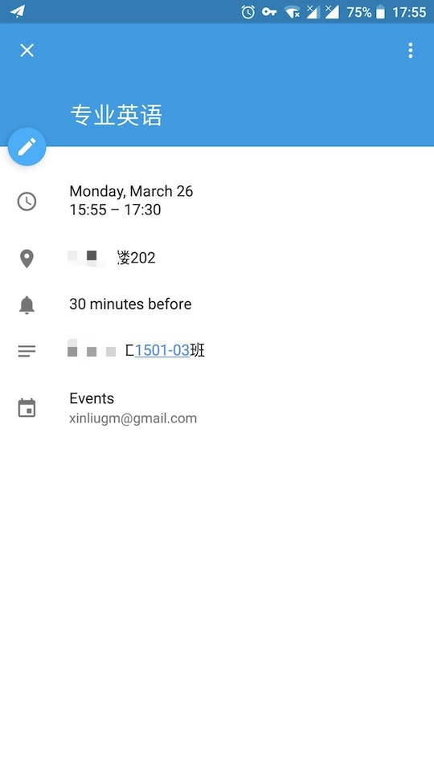

# Course Hunter in nodejs
Retrieving course arrangement from HUB in **ICS** / **CSV** / **JSON** ，you can import ICS/CSV file into your calendar application or use the JSON format data according to your wishes.

## Quick start
Install necessary dependencies and serving on http://127.0.0.1:3000 : 
```shell
$ npm i
$ npm start
```
Test it in terminal: 
```shell
# command below will get your course in csv:
$ curl -X POST -d "uname=StudentNum&pwd=PASSWORD&start=2018-02-26&end=2018-06-30&encrypted=false" http://127.0.0.1:3000/course/csv > Downloads/courses.csv

```
By visiting http://127.0.0.1:3000/course/ics or http://127.0.0.1:3000/course/json , you will get course in ics or json.


## Run in Docker 
It's recommended to run the service in a docker container: 
```shell
$ docker-compose up -d
```

> Making sure docker-compose is installed.
>
> If your platform is macOS, comment the **volumes** config in docker-compose[.debug].yml

## Examples
 
 

## TODOs
- [x] containerization with docker
- [ ] user friendly web interface
- [ ] more detailed infomation,such as login failed or internal error
- [ ] rewrite with TS